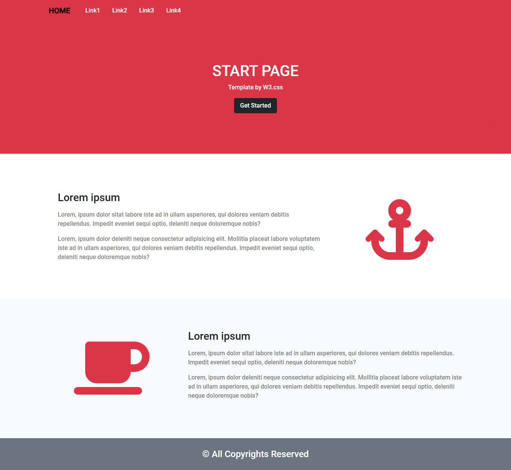

# small-template-project-bootstrap-5-iti

this is a simple bootstrap template . it contains html file and bootstrap file.

## Table of contents

- [Overview](#overview)
- [Installation](#Installation)
- [Links](#Links)
- [Screenshot](#Screenshot)
- [What I learned](#what-i-learned)
- [Continued development](#continued-development)
- [Author](#author)
- [Acknowledgments](#Acknowledgments)


## overview
this is a simple bootstrap template . it contains html file and bootstrap file.


## Installation
To get started with this project, follow these steps:

you can clone the project or download it as Zip file.
 Clone the repository:
   ```bash
   git clone https://github.com/olahasan/small-template-project-bootstrap-5-iti.git
```

## Links

If you want to open the link in a new tab, you can:

- Press **Ctrl** (or **Cmd** on Mac) while clicking the link.
- Right-click the link and select **Open link in new tab**.

Otherwise, all links will open in the same tab.

- Solution URL: [here](https://github.com/olahasan/small-template-project-bootstrap-5-iti)

- Live Site URL: [here](https://olahasan.github.io/small-template-project-bootstrap-5-iti/)


 ## Screenshot
 



## what-i-learned
Through this project, I learned how to use html with bootstrap-5 ,
how to push it on github+gh-pages

## Continued Development
In the future, I plan to:
- learn javascript and reactJs and ....

### Author

GitHub - @olahasan
**[olahasan](https://github.com/olahasan)**

### Acknowledgments

I would like to thank the **[iti](https://iti.gov.eg/home)** for providing this challenge and to the community for their support.
